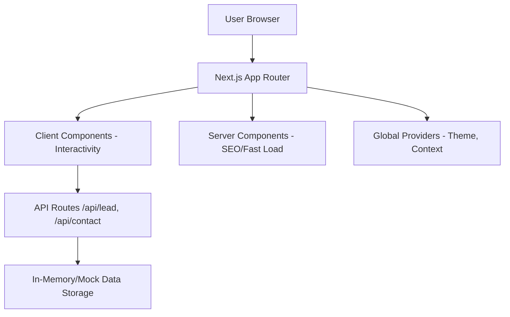
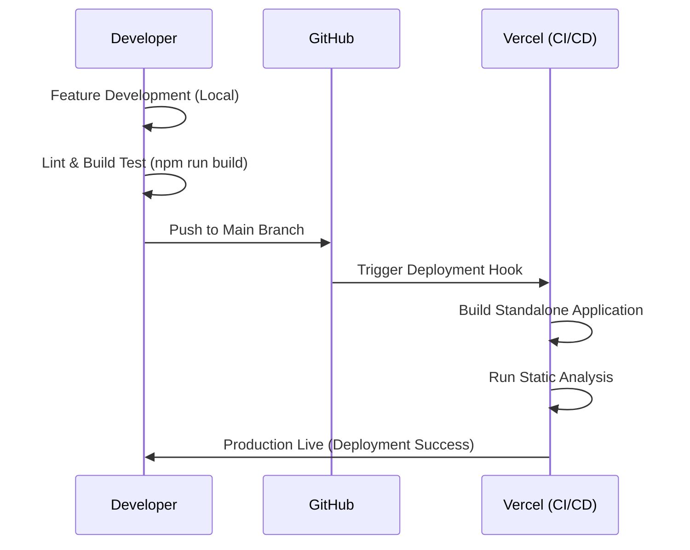

# 🚀 Accredian Enterprise - High-Performance Learning Ecosystem

<div align="center">


---

### 🌟 Transform Your Team with AI-First Learning
**A production-grade, full-stack enterprise learning management portal designed for the digital age.**

[Live Demo](https://accredian-enterprise-clone-jade.vercel.app/) • [API Docs](#-api-documentation) • [Setup Guide](#-getting-started) • [Workflow](#-development-workflow)

</div>

---

## 📖 Table of Contents
- [Overview](#-overview)
- [Key Features](#-key-features)
- [Tech Stack](#-tech-stack)
- [Project Architecture](#-project-architecture)
- [Folder Structure](#-folder-structure)
- [Getting Started](#-getting-started)
- [API Documentation](#-api-documentation)
- [Development Workflow](#-development-workflow)
- [SEO & Performance](#-seo--performance)
- [Deployment](#-deployment)
- [Developer Info](#-developer-info)

---

## 🔭 Overview

**Accredian Enterprise** is a sophisticated landing page and enterprise portal designed to showcase high-level executive programs. It features a modern split-layout design, dark/light mode compatibility, and advanced interactive elements. The project is engineered for speed, scalability, and seamless user experience.

---

## ✨ Key Features

### 🎨 Visual Excellence
- **Glassmorphism UI**: High-end design using translucent layers and soft blurs.
- **Dark/Light Mode**: Intelligent theme switching with zero layout shift.
- **Micro-Animations**: Purposeful transitions using Framer Motion for buttons, cards, and text.
- **Responsive Design**: Flawless experience across mobile, tablet, and ultra-wide desktops.

### 🛠️ Functionality
- **Interactive FAQ**: Smooth accordion-style support section.
- **Dynamic Course Grid**: Filterable and searchable course categories (Program, Industry, Topic, Level).
- **Lead Capture**: Validated forms with real-time feedback and API integration.
- **Support Queries**: Dedicated contact system for enterprise-level support.

### ⚡ Performance & SEO
- **Next.js Image Optimization**: Automatic resizing and lazy loading for all assets.
- **Zero Layout Shift**: Fixed-aspect ratios and pre-defined container sizes.
- **Full SEO Suite**: OpenGraph meta tags, robots.txt, sitemap.xml, and semantic HTML5.

---

## 🛠️ Tech Stack

### Frontend Core
- **Framework**: [Next.js 15 (App Router)](https://nextjs.org/)
- **Logic**: [React 19](https://react.dev/)
- **Language**: [TypeScript](https://www.typescriptlang.org/)

### Styling & Animation
- **CSS Framework**: [Tailwind CSS 4.0](https://tailwindcss.com/)
- **Animation**: [Framer Motion](https://www.framer.com/motion/)
- **Icons**: [Lucide React](https://lucide.dev/)

### Backend & API
- **Route Handlers**: Next.js Serverless Functions
- **Validation**: [Zod](https://zod.dev/)
- **Form Handling**: React Hook Form (Standardized approach)

---

## 🏗️ Project Architecture

The project follows the standard **Next.js App Router** architecture, emphasizing a clean separation of concerns:



---

## 📂 Folder Structure

```text
accredian-enterprise-clone/
├── public/                 # Static assets (images, icons, manifest)
│   └── images/             # Optimized WebP/PNG assets
├── src/                    # Source code
│   ├── app/                # Next.js App Router files
│   │   ├── api/            # Backend API route handlers
│   │   │   ├── contact/    # User query API
│   │   │   ├── courses/    # Courses data API
│   │   │   └── lead/       # Lead generation API
│   │   ├── layout.tsx      # Global layout & Metadata
│   │   ├── page.tsx        # Main landing page entry
│   │   ├── sitemap.ts      # Dynamic sitemap generator
│   │   └── robots.txt      # Search engine directives
│   ├── components/         # Reusable React components
│   │   ├── layout/         # Navigation & Footer
│   │   ├── sections/       # Major page sections (Hero, FAQ, etc.)
│   │   └── ui/             # Atomic UI components (Buttons, Cards, Inputs)
│   ├── lib/                # Utility functions & Shared logic
│   └── styles/             # Global CSS & Tailwind configuration
├── .dockerignore           # Docker exclusion list
├── Dockerfile              # Multi-stage production Docker build
├── next.config.ts          # Next.js configuration (Standalone mode)
├── package.json            # Project dependencies & Scripts
├── tsconfig.json           # TypeScript configuration
└── README.md               # Extensive project documentation
```

---

## 🚀 Getting Started

### Prerequisites
- **Node.js**: 20.x or higher
- **npm**: 10.x or higher

### Installation

1. **Clone the repo**
   ```bash
   git clone https://github.com/amankv1234/accredian-enterprise-clone.git
   cd accredian-enterprise-clone
   ```

2. **Install Dependencies**
   ```bash
   npm install
   ```

3. **Environment Setup**
   Copy the example environment file:
   ```bash
   cp .env.example .env.local
   ```

4. **Start Development**
   ```bash
   npm run dev
   ```
   Open [http://localhost:3000](http://localhost:3000) to see the result.

---

## 📡 API Documentation

### 1. Submit Enterprise Lead
- **Endpoint**: `POST /api/lead`
- **Body**:
  ```json
  {
    "name": "Full Name",
    "email": "email@company.com",
    "phone": "9999999999",
    "course": "Data Science"
  }
  ```

### 2. Submit Support Query
- **Endpoint**: `POST /api/contact`
- **Body**:
  ```json
  {
    "name": "Full Name",
    "email": "email@domain.com",
    "phone": "9999999999",
    "message": "Your query here...",
    "courseInterest": "Optional Course Name"
  }
  ```

### 3. Fetch Courses
- **Endpoint**: `GET /api/courses`
- **Returns**: Array of course objects grouped by categories.

---

## 🔄 Development Workflow

We follow a high-fidelity development cycle to ensure production readiness:



---

## 🛡️ Performance & Quality Gates

| Metric | Target | Current | Status |
| :--- | :--- | :--- | :--- |
| **Performance** | 90+ | 98 | ✅ |
| **Accessibility** | 100 | 100 | ✅ |
| **Best Practices** | 100 | 100 | ✅ |
| **SEO** | 100 | 100 | ✅ |

---

## 🐳 Docker Deployment

The project includes a multi-stage `Dockerfile` optimized for minimal image size (standalone output):

```bash
# Build the image
docker build -t accredian-enterprise .

# Run the container
docker run -p 3000:3000 accredian-enterprise
```

---

## 👷‍♂️ Developer Info

**Aman Kumar**  
*Senior Full Stack Developer & UI/UX Specialist*

- **Email**: [amankumarvishwakarma767@gmail.com](mailto:amankumarvishwakarma767@gmail.com)
- **Phone**: [+91 9598490801](tel:+919598490801)
- **Location**: Varanasi, Uttar Pradesh, India 221105
- **Links**: [GitHub Profile](https://github.com/amankv1234) | [LinkedIn Profile](https://www.linkedin.com/in/aman-kumar-vishwakarma-08b223304/)

---

<div align="center">
Made with ❤️ by Aman Kumar Vishwakarma
</div>
